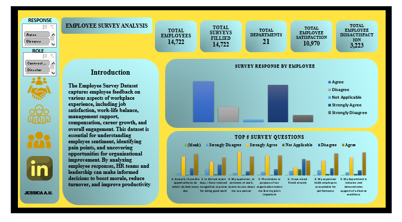

# EMPLOYEE-SURVEY-ANALYSIS-DASHBOARD

## Introduction:

The Employee Survey Dataset captures employee feedback on various aspects of workplace experience, including job satisfaction, work-life balance, management support, compensation, career growth, and overall engagement. This dataset is essential for understanding employee sentiment, identifying pain points, and uncovering opportunities for organizational improvement. By analyzing employee responses, HR teams and leadership can make informed decisions to boost morale, reduce turnover, and improve productivity.

## Key Metrics:
1. Engagement Score
2. Job Satisfaction Rate
3. How included employees feel in the workplace.
4. Leadership Trust
5. Work-Life Balance
6. Team Collaboration

## Skills Used:
1. Data Collection & Cleaning
2. Data Analysis
3. Visualization & Reporting
4. Storytelling & Insights

## Summary:

-Analysis of the Employee Survey Dataset reveals several key trends:

-Overall Satisfaction: A majority of employees reported moderate-to-high satisfaction, though a notable portion expressed dissatisfaction in specific areas.

-Work-Life Balance: Responses show a mixed experience — some employees appreciate flexibility, while others cite workload as a major stressor.

-Management & Leadership: Feedback indicates that direct supervisors are generally supportive, but communication from upper management could be improved.

-Compensation & Benefits: Many employees feel compensation is fair but not fully competitive, with benefits cited as an area for potential enhancement.

-Career Development: Opportunities for growth and training are frequently mentioned as a concern, particularly among younger employees seeking advancement.

-Engagement Levels: Highly engaged employees are more likely to report positive views of management, fair recognition, and clear career paths.

These findings highlight both strengths (supportive supervisors, fair compensation) and opportunities (career development, workload balance, leadership communication)

## Visualization and Analysis

![](

